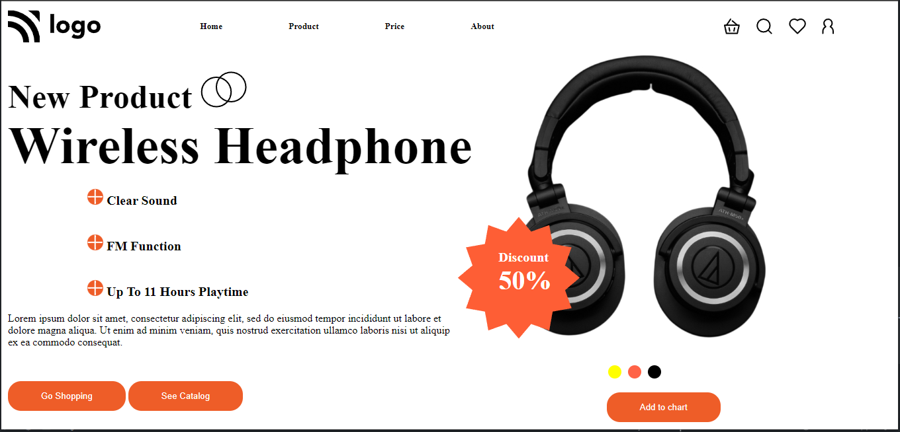

# This is static page 7
## This page is completely build with HTML and CSS(no framework)

### process 
 A thumbnail is given to us with html page and a blank CSS file .All the CSS page is written and designed  by me 
### fault in version 1
not at all responsive 
 ### total time to complete
 - took me around 2 hours to complete this page from scratch
### Main techniques learned during this project
-   how to round any div  
-   flexbox
-   proper z index 
-   manage 

 ## live link
 [LIVE LINK]("https://headphonesell.netlify.app/")

 # RESULT
 ## my Result
 
 ## Given

